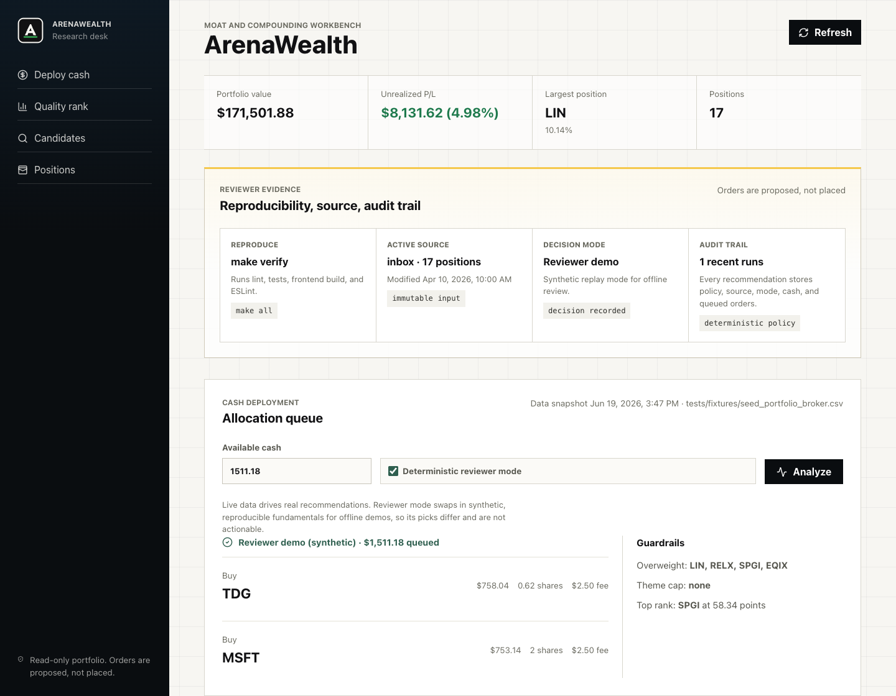

# ArenaWealth

ArenaWealth is a reviewer artifact for auditing AI investment recommendations
against a deterministic, replayable portfolio baseline. The artifact does not
try to prove a new stock-picking alpha. It asks a narrower question first:
before a recommendation earns any return statistic, is it executable, stable
across repeated runs, grounded in the frozen scenario, and consistent with the
portfolio's fee and concentration constraints?



The dashboard is optional, but it shows the same contract the paper studies:
tracked input source, deterministic reviewer mode, proposed orders, guardrails,
and a decision log. Orders are proposed only; no trade is placed.

## Reviewer Path

Use Docker for the shortest science-only check:

```bash
make repro-docker
```

Use the host path when you want the Python tests, frontend checks, regenerated
figures, cached advisor audit, data hashes, and local paper build:

```bash
make setup
make verify-data
make verify
make experiments
make ai-advisor-audit
make advisor-run-audit
make paper
```

`make all` runs the same host reproduction sequence. The manuscript PDF is not
tracked in Git and is not part of the anonymous mirror; `make paper` builds it
locally from `paper/main.tex` for reviewers who want to compare figures and
source.

## What To Check

| Claim surface | Command or file | Expected evidence |
| --- | --- | --- |
| Data snapshot integrity | `make verify-data` | SHA-256 hashes match `paper/data/DATA_HASHES.txt` |
| Implementation safety | `make verify` | Ruff, pytest, frontend build, and ESLint pass |
| Fee and guardrail figures | `make experiments` | Regenerates `paper/figures/*.tikz` and an experiment JSON |
| Advisor audit benchmark | `make ai-advisor-audit` | Regenerates the offline audit figure and summary |
| Cached model pilot | `make advisor-run-audit` | Re-evaluates tracked model outputs without API calls |
| Typeset paper | `make paper` | Builds `paper/main.pdf` locally |

## Dashboard Smoke Test

The dashboard can run from the tracked fixture with a temporary database, so it
does not depend on local broker exports or prior decision logs:

```bash
rm -f tmp/reviewer-dashboard.db
ARENAWEALTH_PORTFOLIO_INBOX="$PWD/tests/fixtures" \
ARENAWEALTH_DATABASE_PATH="$PWD/tmp/reviewer-dashboard.db" \
./run.sh
```

Open:

```text
http://127.0.0.1:5173/?offline_demo=true&cash=1511.18
```

Then click `Analyze`. The expected path is visible in the screenshot above:
reviewer mode uses synthetic replay fundamentals, reads
`tests/fixtures/seed_portfolio_broker.csv`, proposes orders, records a decision,
and displays the guardrails that excluded overweight positions.

## Frozen Inputs

The reproducible results use only tracked inputs:

- `tests/fixtures/seed_portfolio_broker.csv` - reviewer-safe portfolio fixture.
- `paper/data/returns_matrix.csv` - frozen adjusted-return matrix for the
  current-basket study.
- `paper/data/price_backtest_reference.json` - tracked backtest reference used
  when live price exports are absent.
- `paper/data/ai_advisor_scenarios.json` - 120 frozen advisor-audit scenarios.
- `paper/data/advisor_runs/azure/chat/*.json` - cached paid-provider pilot
  outputs, prompts, hashes, usage metadata, and parsed responses.

No API key is required for the reported results. Live advisor collection is
opt-in and budget-capped:

```bash
python scripts/collect_advisor_runs.py --provider azure --model chat --runs 3 --live --max-calls 10
```

Estimate a planned live run without spending money:

```bash
make advisor-budget
```

## Key Insight

Agreement is not validity. A model can match the baseline tickers while
splitting sub-tranche cash into fee-worsening orders, citing unsupported facts,
or overspending cash. ArenaWealth separates three axes that a single return or
overlap score conflates:

- `validity`: every recommendation satisfies deterministic constraints;
- `stability`: repeated runs remain consistent, including amount-aware sizing;
- `agreement`: the output overlaps with the deterministic baseline.

The fee math is intentionally small. The broker fee is a started-tranche step
function, splitting cannot reduce that fee, and the economic order floor is
`fee / tolerance`. Everything else is measured by executable code and exact
tests.

## Scope

This artifact is anonymous and venue-neutral. It intentionally excludes private
portfolio exports, local `.env` files, downloaded bibliography PDFs, generated
reports under `exports/`, and the compiled submission PDF. The backtest is a
current-basket price-history calibration, not a point-in-time stock-selection
test. The cost model covers fixed per-order tranche fees; spreads, taxes,
slippage, liquidity, and integer-lot rules are documented as extension
predicates rather than silently modeled.
